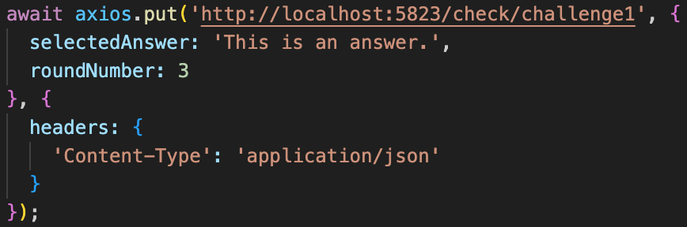

# scoring-microservice-a

### Request

Make a PUT request to http://localhost:5823/check/:id, where :id is the uuid of the Challenge. The request body should include { selectedAnswer: string, roundNumber: number }, where the selectedAnswer is the user's guess to match against the challenge's expected answer and the roundNumber is the number of the round of the current challenge.

Example with axios:
 

### Response

The response will be a JSON object with a message (string) explaining that the answer was correct or incorrect, an updated score (number) and an updated streak (number).

Example:
<code>
{
    "message": "Correct!",
    "score": 40,
    "streak": 2
}
</code>

### UML Diagram

